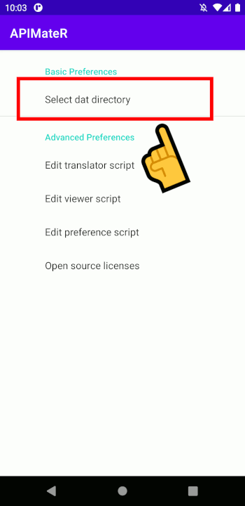
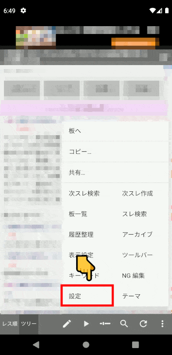

APIMateR
====

Retrieve, translate, write, and view dat file.
This application is inspired by the apiMate.

## Usage



or

```Text
APIMateR apimater:https://{$host}/test/read.cgi/{$bbs}/{$key}/{$host[match:\.([25]ch\.net|bbspink\.com)$]}
```


